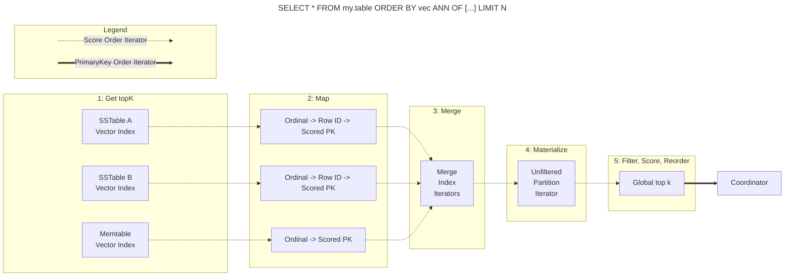
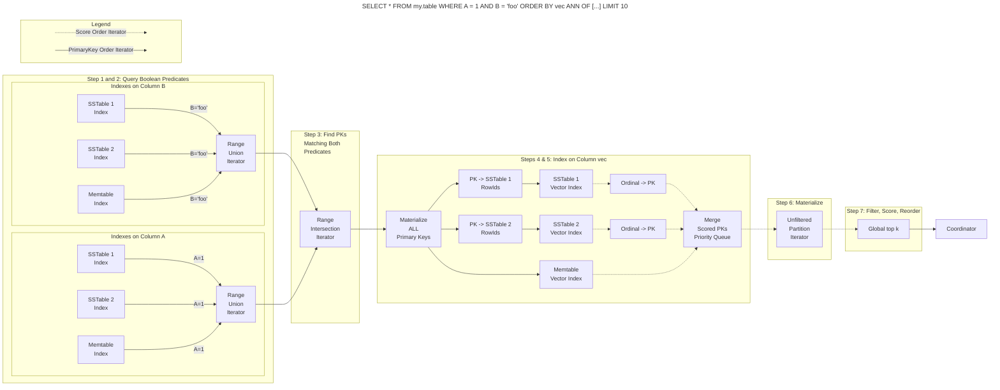

<!--
#
# Licensed to the Apache Software Foundation (ASF) under one
# or more contributor license agreements.  See the NOTICE file
# distributed with this work for additional information
# regarding copyright ownership.  The ASF licenses this file
# to you under the Apache License, Version 2.0 (the
# "License"); you may not use this file except in compliance
# with the License.  You may obtain a copy of the License at
#
#     http://www.apache.org/licenses/LICENSE-2.0
#
# Unless required by applicable law or agreed to in writing, software
# distributed under the License is distributed on an "AS IS" BASIS,
# WITHOUT WARRANTIES OR CONDITIONS OF ANY KIND, either express or implied.
# See the License for the specific language governing permissions and
# limitations under the License.
#
-->

# SAI Vector ANN Query Execution

## Overview

Vector search within SAI has taken two major forms to date. The first utilized PrimaryKey ordered iterators and was
very sensitive to Shadowed Primary Keys as well as overwritten vectors for rows. The second utilized Score ordered
iterators, which was able to handle these cases more gracefully.

This document describes vector search using Score ordered iterators.

## Storage-Attached Index Basics

* We can create indexes on columns to support searching them without requiring `ALLOW FILTERING` and without requiring
that they are part of the primary key
* An indexed column index consists of local indexes for each memtable and each sstable segment within the table
* Query execution scatters across each index to get the collection of Primary Keys that satisfy a predicate
* Each sstable segment's index is immutable
* Memtable indexes are mutable and are updated as the memtable is updated

## Vector Index Basics

* A vector index gives us the ability to search for similar vectors
* We take advantage of the fact that each sstable segment is immutable and finite
* If we take the top k vectors from each sstable segment, we can materialize them from storage and get the top k vectors
  from the entire table (more on this later)
* The `K` in `topK` is generally the `LIMIT` of the query, but can be larger (more on this later)

## Query Types

### Vector Only Query

When a query is only limited by ANN, the query execution is scatter gather across all relevant vector indexes. The query
results in a lazily evaluated iterator that materializes rows from storage in index score order, which can differ from
the "global" score order in the case of updates.
1. Eagerly query each sstable's and memtable's vector indexes producing local top k ordinals. Return them in best-first score order.
2. Lazily map ordinals to row ids then to Primary Keys keeping them in descending (best-first) score order. 
3. Merge the iterators while maintaining relative score order. This merge does not dedupe iterator elements.
4. Materialize one row from storage at a time.
5. Filter out deleted rows. Then, compute the vector similarity score. If the score is at least as good as the score computed by the index, the vector 
   is in the global top k. If it is worse than the index's score, temporarily ignore that key. Finally, reorder into
   Primary Key order.
6. Return the global top k rows to the coordinator.

Notes:
* The flow is much lazier than before. Now, we only materialize the top k rows from storage, not every top k row from
  every sstable segment and memtable.
* Range queries on the Primary Key that do not require an index are supported and are considered ANN only.
* `ALLOW FILTERING` is not supported.

### Pre-fitered Boolean Predicates Combined with ANN Query

When a query relies on non vector SAI indexes and an ANN ordering predicate, the query execution is more complex. The execution
of query `SELECT * FROM my.table WHERE x = 1 AND y = 'foo' ORDER BY vec ANN OF [...] LIMIT 10` follows this path:
1. Query each boolean predicate's index to get the Primary Keys that satisfy the predicate.
2. Merge the results with a `RangeUnionIterator` that deduplicates results for the predicate and maintains PK ordering.
3. Intersect the results with a `RangeIntersectionIterator` to get the Primary Keys that satisfy all boolean predicates.
4. Materialize the Primary Keys that satisfy all boolean predicates.
5. Map resulting Primary Keys back to row ids and search each vector index for the local top k ordinals, then map those to 
Primary Keys. Ultimately producing a single score ordered iterator. **This is expensive.**
6. Materialize one row from storage at a time.
7. Filter out deleted rows and validate the row against the logical filter. If the row does not match the WHERE clause, ignore the result. Then,
   compute the vector similarity score. If the score is at least as good as the score computed by the index, the vector
   is in the global top k. If it is worse than the index's score, temporarily ignore that key. Finally, reorder into
   Primary Key order.
8. Return the global top k rows to the coordinator.

### Post-fitered Boolean Predicates Combined with ANN Query

Sometimes, the boolean predicates are expensive to evaluate using the pre-filtered approach described above. An
alternate query execution path is to sort the results using ANN first, then filter the materialized rows using the
boolean predicates. The execution of query `SELECT * FROM my.table WHERE x = 1 AND y = 'foo' ORDER BY vec ANN OF [...] LIMIT 10` 
using a post-filtered approach follows the same path as the [Vector Only Query](#vector-only-query) with the exception
that the "filter" in step 7 additionally applies the boolean predicates and filters out any rows that do not match.

The primary cost of post-filtering is that we might materialize many rows before finding the ones that match the boolean
predicates. As such, we have a cost based optimizer that helps determine which approach is best for a given query.